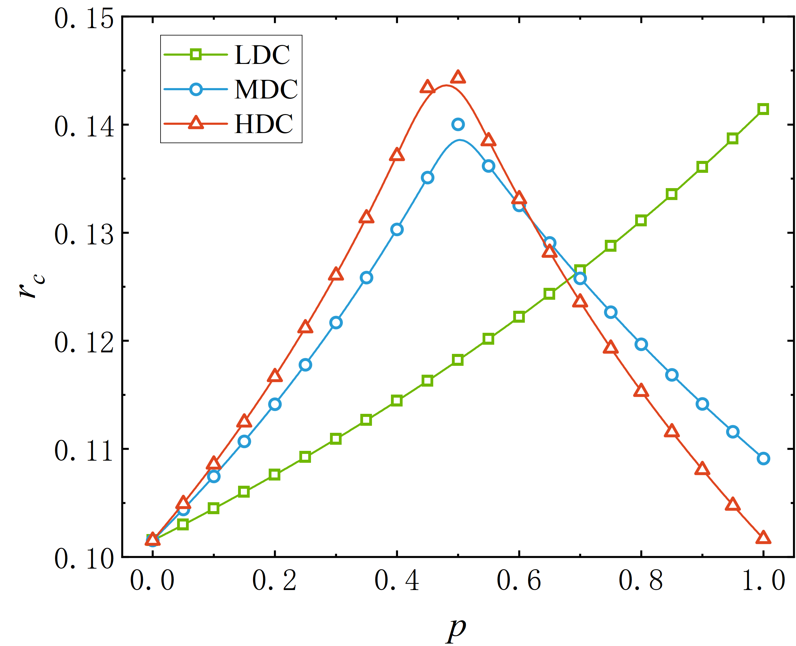

# Layer Positioning in Multilayer Traffic Networks

[](https://en.wikipedia.org/wiki/C%2B%2B)
[](https://opensource.org/licenses/MIT)

This repository contains the source code for the numerical simulations and theoretical analyses presented in the manuscript:
**"The Role of Layer Positioning in Multilayer Traffic Networks: A Trade-Off Between Path Efficiency and Load Balancing"**

## 1. Overview
This project simulates traffic dynamics on heterogeneous multilayer networks to investigate how the relative positioning of layers (i.e., which layer acts as the structural core) impacts the global traffic capacity. The codebase evaluates the fundamental trade-off between path efficiency and load balancing driven by inter-layer and intra-layer traffic.

### Core Features
- **Supported Topologies**: Erdős-Rényi (ER), Barabási-Albert (BA), and spatially-embedded Random Geometric Graphs (RGG).
- **Positioning Strategies**: 
  - `LDC`: Low-Degree-Core
  - `MDC`: Medium-Degree-Core
  - `HDC`: High-Degree-Core
- **Core Algorithms**:
  - Computes intra-layer ($b_I$) and inter-layer ($b_E$) effective betweenness centrality based on recursive shortest-path tree traversals.
  - Utilizes **Cell-List (Grid) algorithms** for efficient spatial connection building in RGGs ($O(N)$ complexity locally).
  - Supports **OpenMP** parallelization to accelerate large-scale Monte Carlo simulations and BFS shortest-path searches.

## 2. Project Structure
The codebase is highly modularized into distinct C++ header files to ensure readability and maintainability:
- `main.cpp`: The entry point managing memory allocation, parameter input, and execution flow.
- `BA_network.h` / `ER_network.h` / `RGG_network.h`: Topology generators for individual layers.
- `couple_network.h`: Implements the assortative coupling logic for LDC, MDC, and HDC configurations.
- `shortest_paths.h`: Computes global and layer-specific shortest paths using BFS.
- `calculate_betweenness.h`: Computes node effective betweenness centrality based on recursive shortest-path tree traversals.
- `dynamics.h`: Agent-based Monte Carlo simulation of packet generation, routing, and congestion.
- `queue_analysis.h` / `layer_betweenness_analysis.h`: Theoretical analysis of critical packet generation rates ($r_c$) and bottleneck identification.

## 3. Prerequisites & Compilation
The code is written in standard C++ and is fully portable across Windows, Linux, and macOS environments.

To compile the code on a Linux/macOS terminal or Windows Subsystem for Linux (WSL), use a standard C++ compiler (e.g., `g++`):

```bash
g++ -O3 main.cpp -o traffic_sim -fopenmp
```

## 4. Quick Start & Usage Example
To allow reviewers and users to quickly verify the code functionality without manual input, you can use the following automated pipeline command in a Linux/macOS terminal:

```bash
echo "0.4 LDC 0.10 0.15 0.001 50 1" | ./traffic_sim
```

**Parameters Explanation (in order of input):**
* `0.4`: Inter-layer connection probability ($p$)
* `LDC`: Layer positioning strategy (`LDC`, `MDC`, or `HDC`)
* `0.10`: Starting packet generation rate ($r_{start}$)
* `0.15`: Ending packet generation rate ($r_{end}$)
* `0.001`: Step size of $r$
* `50`: Number of independent ensemble runs for averaging
* `1`: Network topology selection (e.g., 1 for ER networks)

*(Note: For a rapid functional test, you can reduce the ensemble runs and increase the step size, e.g., `echo "0.4 LDC 0.10 0.12 0.02 1 1" | ./traffic_sim`)*

## 5. Reproducibility & Example Results
To guarantee immediate and meaningful reproducibility, we have provided an `example_results/` directory in this repository. 
It contains the raw data output and a reproduced visualization plot of our core physical finding—the traffic capacity reversal between LDC and HDC strategies (**corresponding to Figure 3 in the manuscript**). Users can visually verify the correctness of the theoretical analysis without needing to run extensive simulations from scratch.

<p align="center">
  
</p>